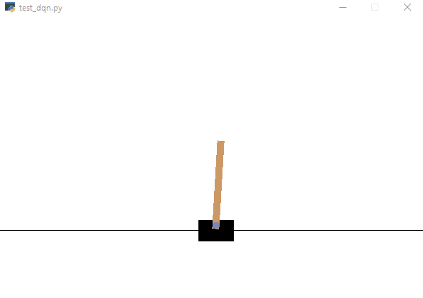
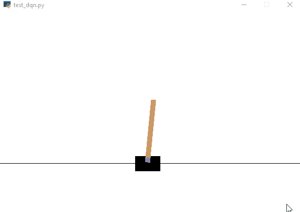
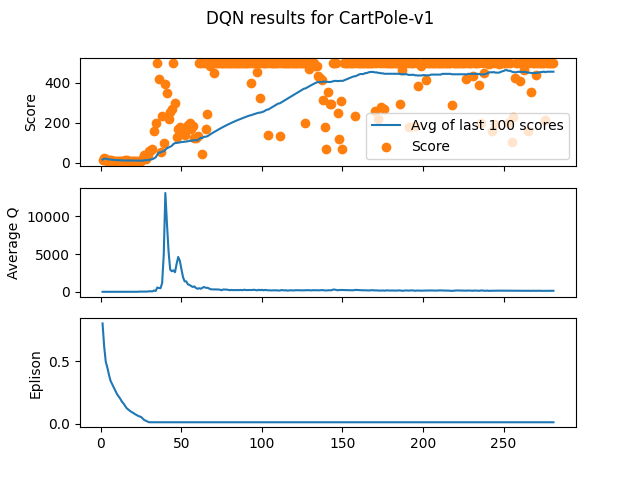
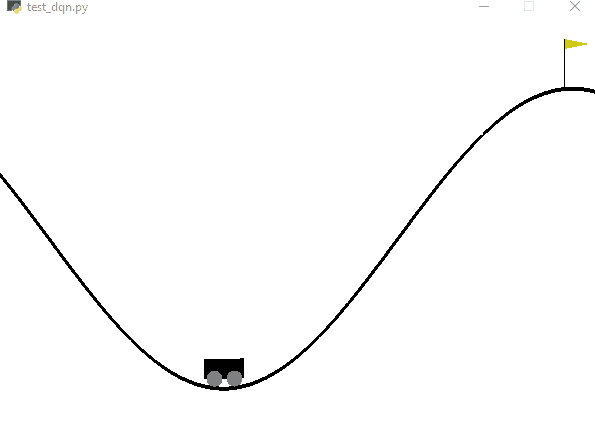
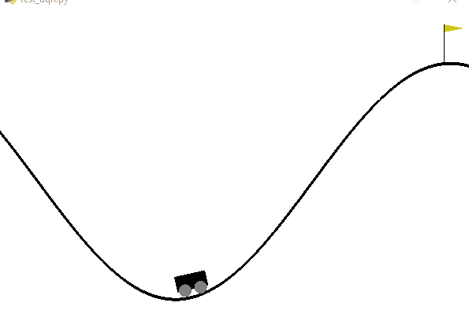
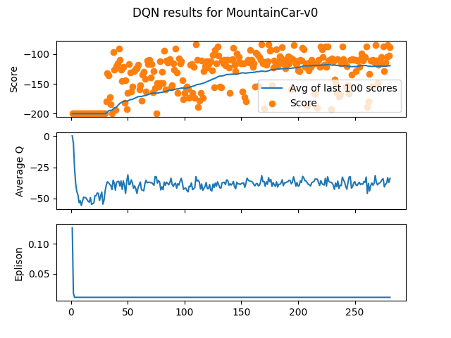
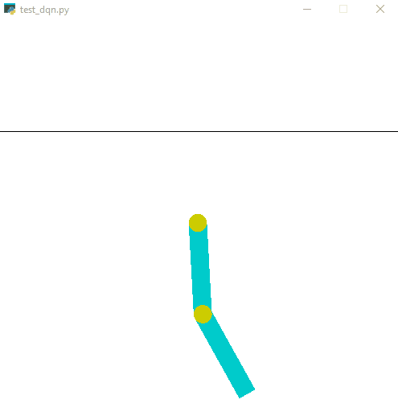
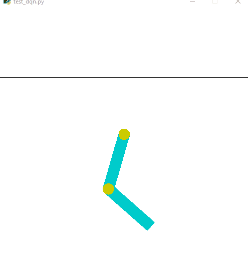
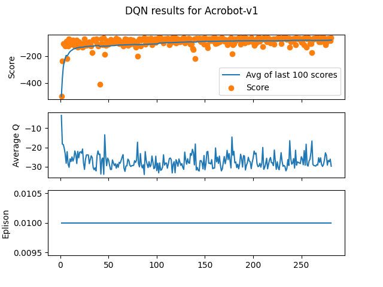

# Deep Q Neural Network to solve OpenAI Classic Control Problems (CartPole, Acrobot, MountainCar)

### Files Included
`DQN_Agent.py` contains classes for the Experience Replay Buffer, for the DQN Model and Agent
`train_dqn.py` will run train the DQN Agent on a gym specified from a list and save relavent plots in a directory with the gym's name
`test_dqn.py` will render the environement of the gym to test the model saved in a .h5 file

### Dependencies

	matplotlib
	deque
	numpy
	random
	gym
	keras

## Hyper Parameters

	epsilon_start =  0.95
	epsilon_decrement = 0.99
	eplison_min = 0.01
	learning_rate = 0.001 # alpha
	gamma = 0.99 
	batch_size = 256
	layer_dimensions = 512
	replay_buffer_size = 1_000_000
	num_trials = 300

### Plots
The first plot has the score achieved in each trial plotted in orange with the average of the last 100 scores plotted in blue.
The second plot describes the maximum Q (action-value) of each step, where the average for each trial is one point. This represents how confident the model is for a chosen action and is a more reliable metric for its learning as opposed to the noisy score values. [Reference](https://www.cs.toronto.edu/~vmnih/docs/dqn.pdf)
The third plot represents the probability to chose random actions with the epsilon-greedy approach. This is a solution to the problem of exploration vs. exploitation or when to try a different, unconventional move in hopes of finding a better solution.

## [CartPole-v1](https://github.com/openai/gym/wiki/CartPole-v0)

OpenAI Gym's Cartpole problem is an environment where the goal is to train an agent to balance a pole on a moving cart with limitations as below:

    Observation: 
        Type: Box(4,)
        Num	Observation                 Min         Max
        0	Cart Position             -4.8            4.8
        1	Cart Velocity             -Inf            Inf
        2	Pole Angle                 -24°           24°
        3	Pole Velocity At Tip      -Inf            Inf
        
    Action:
        Type: Discrete(2)
        Num	Action
        0	Push cart to the left
        1	Push cart to the right
        

Below shows how the Agent behaves completely untrained  (If the GIF stops, refresh the page)

Below shows the Agent's performance after 281 attempts, you can see the substantial improvement from the above. (If the GIF stops, refresh the page)

This is a plot showing how the Agent improved over time.

## [MountainCar-v0](https://github.com/openai/gym/wiki/MountainCar-v0)

OpenAI Gym's Cartpole problem is an environment where the goal is to train an agent to move a car to the top of a hill. The car's engine is not strong enough to clear the hill in one pass, so the agent must use momentum to climb the hill with limitations as below:

    Observation:
		Type: Box(2)
		Num	Observation	Min	Max
		0	position	-1.2	0.6
		1	velocity    -0.07	0.07
        
    Action:
        Type: Discrete(3)
		Num	Action
		0	push left
		1	no push
		2	push right
        

Below shows how the Agent behaves completely untrained  (If the GIF stops, refresh the page)

Below shows the Agent's performance after 281 attempts, you can see the substantial improvement from the above. (If the GIF stops, refresh the page)

This is a plot showing how the Agent improved over time.

## [Acrobot-v1](https://github.com/openai/gym/blob/master/gym/envs/classic_control/acrobot.py)

OpenAI Gym's Acrobot-v1 problem is an environment where the goal is to train an agent to move the tip of a double pendulum above a certain threshold with limitations as below:

	Observation:
		Type: Box(2)
		The observation consists of the sin() and cos() of the two rotational joint
	    angles and the joint angular velocities :
	    [cos(theta1) sin(theta1) cos(theta2) sin(theta2) thetaDot1 thetaDot2]
        
    Action:
        Type: Discrete(3)
		Num	Action
		0	+1 torque on joint
		1	0 torque on joint
		2	-1 torque on joint
        

Below shows how the Agent behaves completely untrained  (If the GIF stops, refresh the page)

Below shows the Agent's performance after 281 attempts, you can see the substantial improvement from the above. (If the GIF stops, refresh the page)

This is a plot showing how the Agent improved over time.

